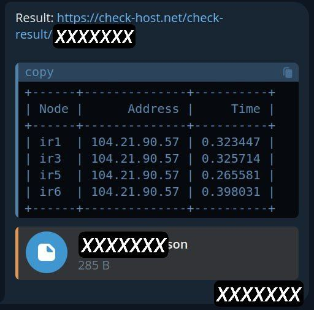

### linux-monitoring
Do you want to know if your server is accessible from a certain country?
There is a Python code powered by [check-host.net API](https://check-host.net/about/api) that can monitor your accessibility and send results to your telegram bot. if you want to use spesific node check [this](https://check-host.net/nodes/hosts).

### How to use?

### Docker (recommended)
1- docker pull alirezaf75/check-host:latest \
2- get docker-compose.yml from repo \
3- create `.env` like `.env.example` \
4- docker compose up -d

### Without Docker
1- clone latest release \
2- create `.env` like `.env.example` \
3- run code with `bash ./run.sh`
